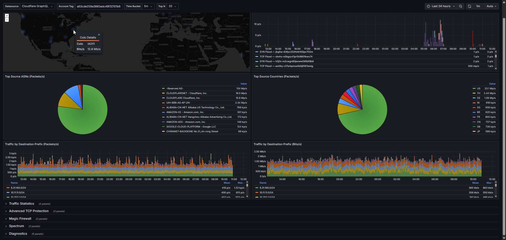

# Cloudflare Network Analytics — Grafana Dashboard



A modern Grafana dashboard for **Cloudflare Network Analytics (NAv2)**, deployed as a **Cloudflare Worker Container** and protected by **Cloudflare Access**.

Uses the [Grafana Infinity datasource plugin](https://grafana.com/grafana/plugins/yesoreyeram-infinity-datasource/) to query the Cloudflare GraphQL Analytics API directly. The dashboard opens in **kiosk mode** by default (no Grafana chrome) with a **24-hour** time window.

---

## Dashboard Panels

### Overview (expanded by default)

| Panel | Type | Description |
|-------|------|-------------|
| Colo Heatmap | Geomap | Geographic heatmap of traffic volume across Cloudflare colos, grouped by geohash to de-duplicate co-located colos |
| Top Attacks (Packets/s) | Timeseries | Top dropped attack timeseries grouped by Attack Vector and Attack ID |
| Top Source ASNs (Packets/s) | Pie chart | Top N source ASNs by packet rate |
| Top Source Countries (Packets/s) | Pie chart | Top N source countries by packet rate |
| Passed Traffic by Protocol (Packets/s) | Timeseries | Passed traffic grouped by IP protocol (TCP, UDP, etc.) — stacked bars |
| Passed Traffic by Protocol (Bits/s) | Timeseries | Same as above in bits per second |
| Traffic by Destination Prefix (Packets/s) | Timeseries | All passed traffic grouped by destination subnet — stacked bars |
| Traffic by Destination Prefix (Bits/s) | Timeseries | Same as above in bits per second |

### Traffic Statistics (collapsed)

| Panel | Type | Description |
|-------|------|-------------|
| Dropped Traffic Rates By Mitigation System (Packets/s) | Timeseries | Dropped traffic grouped by mitigation system — stacked bars |
| Dropped Bit Rates By Mitigation System (Bits/s) | Timeseries | Same as above in bits per second |

### Advanced TCP Protection (collapsed)

| Panel | Type | Description |
|-------|------|-------------|
| New TCP Connections by Destination | Timeseries | New TCP connections grouped by destination subnet |
| Drops by Mitigation Reason (Packets/s) | Timeseries | dosd drops grouped by mitigation reason and protocol state |
| TCP Challenge Activity by Destination (Connections/s) | Timeseries | SYN cookie challenge events (CHALLENGE_NEEDED + CHALLENGE_PASSED) grouped by destination and reason |
| Challenge Success Rate (Connections/s) | Timeseries | CHALLENGE_NEEDED vs CHALLENGE_PASSED over time — high needed with low passed indicates spoofed SYN floods |
| Top Challenged Source IPs | Pie chart | Top source IPs triggering flowtrackd SYN cookie challenges |

### Magic Firewall (collapsed)

| Panel | Type | Description |
|-------|------|-------------|
| Drops by Rule ID (Packets/s) | Timeseries | Magic Firewall drops grouped by rule ID |
| Drops by Destination (Packets/s) | Timeseries | Magic Firewall drops grouped by destination subnet |
| Drops by Protocol (Packets/s) | Timeseries | Magic Firewall drops grouped by IP protocol (TCP, UDP, ICMP, etc.) |
| Top Blocked Source IPs | Pie chart | Top source IPs blocked by Magic Firewall rules |
| Top Blocked Source Countries | Pie chart | Geographic origin of traffic blocked by Magic Firewall |

### Spectrum (collapsed)

| Panel | Type | Description |
|-------|------|-------------|
| Traffic by Destination IP (Packets/s) | Timeseries | Spectrum traffic grouped by destination IP |
| Traffic by Destination IP (Bits/s) | Timeseries | Same as above in bits per second |
| Drops by Destination IP (Packets/s) | Timeseries | Spectrum drops grouped by destination IP |

### Diagnostics (collapsed)

| Panel | Type | Description |
|-------|------|-------------|
| Fragmented Packet Rate (Packets/s) | Timeseries | Packets with IP `moreFragments` flag set |
| Fragmented Traffic Rate (Bits/s) | Timeseries | Same as above in bits per second |
| ICMP "Fragmentation Needed" Rate (Packets/s) | Timeseries | ICMP type 3 code 4 (Path MTU Discovery) packets |
| Top Source IPs Sending Fragments | Pie chart | Top source IPs sending fragmented packets (`ipMoreFragments: 1`) |

### GraphQL Data Sources

| Section | GraphQL Node |
|---------|-------------|
| Overview, Traffic Statistics, Diagnostics | `magicTransitNetworkAnalyticsAdaptiveGroups` |
| Top Attacks | `dosdNetworkAnalyticsAdaptiveGroups` |
| Advanced TCP Protection | `flowtrackdNetworkAnalyticsAdaptiveGroups` |
| Magic Firewall | `magicFirewallNetworkAnalyticsAdaptiveGroups` |
| Spectrum | `spectrumNetworkAnalyticsAdaptiveGroups` |

### Dashboard Variables

| Variable | Description | Default |
|----------|-------------|---------|
| `datasource` | Infinity datasource instance | Cloudflare GraphQL |
| `accountTag` | Cloudflare Account ID | — |
| `timeBucket` | Aggregation granularity | FiveMinutes |
| `topN` | Number of items in pie charts | 10 |

---

## Project Structure

```
├── README.md
├── export-dashboard.sh               # Strips account tag → portable JSON for import
├── src/
│   └── index.ts                       # Worker entrypoint — kiosk redirect + edge caching + proxy
├── container/
│   ├── Dockerfile                     # Grafana OSS 11.6 + Infinity plugin
│   └── provisioning/
│       ├── datasources/
│       │   └── cloudflare-graphql.yaml  # Infinity datasource (auto-provisioned)
│       └── dashboards/
│           ├── dashboards.yaml          # Dashboard provider config
│           └── cloudflare-network-analytics.json  # The dashboard
├── wrangler.toml                      # Worker + Container config
├── package.json
├── tsconfig.json
├── .dev.vars.example                  # Template for local secrets
└── .gitignore
```

---

## Architecture

```
User → Cloudflare Access (auth gate)
     → Cloudflare Worker (src/index.ts)
         ├── / → 302 redirect to /d/cf-network-analytics?kiosk
         ├── Static assets (js/css/fonts) → edge cache (24h TTL)
         └── All other requests → proxy to container
     → Grafana Container (port 3000)
     → Infinity Plugin → Cloudflare GraphQL API
```

- **Authentication**: Cloudflare Access (Zero Trust)
- **Compute**: Cloudflare Worker Container (Grafana OSS 11.6)
- **Data**: Cloudflare GraphQL Analytics API (NAv2)
- **Datasource**: Grafana Infinity plugin (GraphQL mode, Bearer token auth)
- **Performance**: Static asset edge caching (24h), container sleeps after 4h of inactivity

---

## Prerequisites

Before you begin, ensure you have:

1. A **Cloudflare account** on the [Workers Paid plan](https://dash.cloudflare.com/?to=/:account/workers/plans) (required for Containers)
2. A Cloudflare product that generates Network Analytics data: **Magic Transit**, **Magic WAN**, and/or **Spectrum**
3. **Docker Desktop** installed and running locally — verify with `docker info`
4. **Node.js** v18+ and npm
5. **Wrangler CLI** installed and authenticated:
   ```bash
   npm install -g wrangler
   wrangler login
   ```

---

## Step 1: Create a Cloudflare API Token

The dashboard queries the Cloudflare GraphQL Analytics API. You need an API token with read access to Account Analytics.

1. Go to [**Account API Tokens**](https://dash.cloudflare.com/?to=/:account/api-tokens)
2. Click **Create Token**
3. Under **Custom token**, click **Get started**
4. Configure the token:
   - **Token name**: `Grafana Network Analytics`
   - **Permissions**: select **Account** → **Account Analytics** → **Read**
   - **Zone Resources**: select **All zones** (or scope to specific zones if preferred)
   - (Optional) Set **IP Address Filtering** or **TTL** for additional security
5. Click **Continue to summary** → **Create Token**
6. **Copy the token immediately** — it will not be shown again. Store it securely.
7. Test the token:
   ```bash
   curl -s -H "Authorization: Bearer YOUR_TOKEN_HERE" \
     https://api.cloudflare.com/client/v4/user/tokens/verify
   ```
   You should see `"status": "active"` in the response.

---

## Step 2: Find Your Cloudflare Account Tag

1. Go to [**Cloudflare Dashboard**](https://dash.cloudflare.com/) and select your account
2. Look at the URL in your browser: `https://dash.cloudflare.com/abc123def456...`
3. The hex string after `dash.cloudflare.com/` is your **Account Tag** (e.g., `abc123def456789...`)
4. You will enter this in the Grafana dashboard's `accountTag` variable after deployment (or edit the JSON default before deploying)

---

## Step 3: Clone and Install

```bash
git clone <your-repo-url>
cd grafana-network-analytics-dashboard
npm install
```

---

## Step 4: Configure Secrets

Worker secrets are encrypted and stored by Cloudflare. They are passed into the Grafana container as environment variables at runtime.

```bash
# Set your Cloudflare API token (from Step 1)
npx wrangler secret put CF_API_TOKEN
# Paste your token when prompted, then press Enter
```

> **Note**: This secret is encrypted at rest and never visible in the dashboard or Wrangler output after being set.

---

## Step 5: Deploy to Cloudflare Workers Containers

1. Ensure Docker is running:
   ```bash
   docker info
   ```

2. Deploy:
   ```bash
   npx wrangler deploy
   ```

   This command will:
   - **Build** the Grafana container image locally using Docker
   - **Push** the image to Cloudflare's integrated Container Registry (backed by R2)
   - **Deploy** the Worker that routes HTTP requests to the Grafana container

3. **Wait 2–5 minutes** for the container to provision on first deploy

4. Your dashboard will be available at:
   ```
   https://grafana-network-analytics.<your-subdomain>.workers.dev
   ```

   Find your workers.dev subdomain at [Workers & Pages settings](https://dash.cloudflare.com/?to=/:account/workers/subdomain).

### How it works

- The **Worker** (`src/index.ts`) receives all HTTP requests, redirects `/` to kiosk mode, edge-caches static assets, and proxies everything else to the Grafana container
- The **Container** runs Grafana OSS with the Infinity datasource plugin pre-installed
- The dashboard and datasource are **auto-provisioned** — no manual Grafana setup needed
- `max_instances = 1` ensures a single stateful Grafana instance (SQLite DB)
- `sleepAfter = "4h"` puts the container to sleep after 4 hours of inactivity to save costs; it wakes automatically on the next request

---

## Step 6: Protect with Cloudflare Access

Cloudflare Access acts as a Zero Trust authentication layer in front of your Grafana instance. No one can reach Grafana without first authenticating through Access.

### 6a. Set Up an Identity Provider (if not already configured)

1. Go to [**Cloudflare One**](https://one.dash.cloudflare.com) → **Settings** → **Authentication**
2. Under **Login methods**, click **Add new**
3. Choose your identity provider:
   - **One-time PIN** (email-based, easiest to start)
   - **Google**
   - **GitHub**
   - **Okta / SAML**
   - Or any other supported IdP
4. Follow the setup wizard for your chosen provider
5. Click **Save**

### 6b. Create an Access Application

1. Go to [**Cloudflare One**](https://one.dash.cloudflare.com) → **Access controls** → **Applications**
2. Click **Add an application**
3. Select **Self-hosted**
4. Fill in the application details:
   - **Application name**: `Grafana Network Analytics`
   - **Session Duration**: `24 hours` (or your preference)
5. Under **Application domain**, add a public hostname:
   - **Subdomain**: `grafana-network-analytics` (must match your Worker name)
   - **Domain**: select your `workers.dev` subdomain, e.g., `your-subdomain.workers.dev`
   - If using a custom domain (see Step 7), use that domain instead

### 6c. Create an Access Policy

1. On the same page, under **Policies**, click **Add a policy**
2. Configure:
   - **Policy name**: `Allow team`
   - **Action**: `Allow`
   - **Configure rules**:
     - **Include** → **Emails ending in** → `@yourdomain.com`
     - Or **Include** → **Emails** → add specific email addresses
     - Or **Include** → **Identity Provider Groups** → select a group from your IdP
3. Click **Save policy**

### 6d. Save and Test

1. Click **Save application**
2. Visit your Worker URL: `https://grafana-network-analytics.<your-subdomain>.workers.dev`
3. You should see the **Cloudflare Access login page**
4. After authenticating, you'll be redirected to the Grafana dashboard in kiosk mode

> **Why anonymous auth is enabled in Grafana**: Since Cloudflare Access handles authentication, Grafana is configured with anonymous viewer access. Only users who pass the Access gate can reach Grafana at all.

---

## Step 7: Custom Domain (Optional)

Instead of using the `workers.dev` subdomain, you can use your own domain.

1. In your Cloudflare DNS settings, add a CNAME record:
   - **Name**: `grafana` (or whatever subdomain you want)
   - **Target**: `grafana-network-analytics.<your-subdomain>.workers.dev`
   - **Proxy status**: Proxied (orange cloud)

2. Add a route to `wrangler.toml`:
   ```toml
   routes = [{ pattern = "grafana.yourdomain.com", zone_name = "yourdomain.com" }]
   ```

3. Update your Cloudflare Access application (Step 6b) to use the new hostname

4. Redeploy:
   ```bash
   npx wrangler deploy
   ```

---

## Step 8: Configure the Dashboard

After deployment, open the Grafana dashboard in your browser.

1. **Set Account Tag**: Click the gear icon or go to **Dashboard Settings** → **Variables** → edit `accountTag` and set it to your Cloudflare Account Tag from Step 2
2. **Adjust Time Range**: The default is last 24 hours. Use the time picker to change.
3. **Time Bucket**: Use the dropdown to select aggregation granularity (1m, 5m, 15m, 1h)
4. **Top N**: Controls how many items appear in pie charts (5, 10, 20, 50)

> **Tip**: If you see empty panels, verify your API token has the correct permissions and that your account has Magic Transit, Magic WAN, or Spectrum traffic.

---

## Local Development

For local testing with Docker:

1. Copy the secrets template:
   ```bash
   cp .dev.vars.example .dev.vars
   ```

2. Edit `.dev.vars` with your actual values:
   ```
   CF_API_TOKEN=your-actual-api-token
   ```

3. Start the local dev server:
   ```bash
   npx wrangler dev
   ```

   This runs the Worker locally and starts the Grafana container via Docker.

---

## Sharing the Dashboard

### Option A: Public Link (no login required)

Grafana 11.6 includes the **Public Dashboards** feature. This creates a read-only public URL that anyone can view — no Grafana account, no Cloudflare Access authentication.

1. Access your Grafana instance (exit kiosk mode by pressing `Esc` or removing `?kiosk` from the URL)
2. Open the dashboard → click **Share** (top bar) → **Public Dashboard** tab
3. Toggle **Enabled** → copy the generated public URL
4. Share the URL — viewers see a live, auto-refreshing, read-only dashboard

> **Note**: The public URL bypasses Cloudflare Access. Anyone with the link can view the dashboard data. The URL is unguessable (random UID), but treat it as sensitive if your traffic data is confidential.

### Option B: Import into Another Grafana Instance

Others can import the dashboard JSON into their own Grafana installation.

**Export a portable dashboard** (strips your account tag):

```bash
./export-dashboard.sh
# → cloudflare-network-analytics.json
```

**Prerequisites on the target Grafana instance:**
- [Infinity datasource plugin](https://grafana.com/grafana/plugins/yesoreyeram-infinity-datasource/) installed
- A Cloudflare API token with **Account Analytics: Read** permission (see [Step 1](#step-1-create-a-cloudflare-api-token))

**Import steps:**

1. In Grafana, go to **Dashboards** → **Import** → **Upload JSON file** → select the exported `cloudflare-network-analytics.json`

2. When prompted, select your Infinity datasource instance

3. Configure the Infinity datasource (if not already done):
   - Go to **Connections** → **Data sources** → **Add data source** → search for **Infinity**
   - Under **Authentication**, set:
     - **Auth Method**: `Bearer Token`
     - **Bearer Token**: your Cloudflare API token
   - Under **Allowed hosts**, add: `https://api.cloudflare.com`
   - Click **Save & Test**

4. Open the imported dashboard and set the **accountTag** variable to your Cloudflare Account Tag (see [Step 2](#step-2-find-your-cloudflare-account-tag))

---

## Customizing the Dashboard

### Add a new panel

1. Open the dashboard JSON at `container/provisioning/dashboards/cloudflare-network-analytics.json`
2. Add a new panel object to the appropriate row's `panels` array
3. Use the same Infinity GraphQL target format as existing panels:
   ```json
   {
     "type": "graphql",
     "source": "url",
     "format": "table",
     "url": "https://api.cloudflare.com/client/v4/graphql",
     "root_selector": "data.viewer.accounts.0.<node>",
     "columns": [
       { "selector": "dimensions.ts", "text": "Time", "type": "timestamp" },
       { "selector": "dimensions.<groupBy>", "text": "<Label>", "type": "string" },
       { "selector": "avg.<metric>", "text": " ", "type": "number" }
     ],
     "url_options": {
       "method": "POST",
       "body_type": "graphql",
       "body_graphql_query": "query { ... }"
     }
   }
   ```
4. Add a `partitionByValues` transformation on the string column to create per-series timeseries
5. Redeploy: `npx wrangler deploy`

### Available GraphQL nodes

| Node | Description |
|------|-------------|
| `magicTransitNetworkAnalyticsAdaptiveGroups` | Magic Transit traffic and DDoS mitigations |
| `dosdNetworkAnalyticsAdaptiveGroups` | DDoS protection system (dosd) events |
| `flowtrackdNetworkAnalyticsAdaptiveGroups` | Advanced TCP protection (flowtrackd) events |
| `magicFirewallNetworkAnalyticsAdaptiveGroups` | Magic Firewall rule matches |
| `spectrumNetworkAnalyticsAdaptiveGroups` | Spectrum traffic and mitigations |

Refer to the [Cloudflare GraphQL Analytics API docs](https://developers.cloudflare.com/analytics/graphql-api/) for the full schema.

---

## Troubleshooting

| Issue | Solution |
|-------|----------|
| Empty panels / no data | Verify API token permissions (Account Analytics: Read). Check that your account has Magic Transit/Spectrum traffic. |
| Container not starting | Run `npx wrangler containers list` to check status. Ensure Docker was running during deploy. |
| Access denied at login | Check your Access policy includes your email/domain. Verify IdP is configured. |
| Dashboard shows "Datasource not found" | The Infinity plugin may not have installed. Rebuild: `npx wrangler deploy` |
| Slow cold start | First request after sleep takes ~10-30s while the container boots. Subsequent requests are fast. Static assets are edge-cached for 24h. |
| Dashboard not in kiosk mode | The Worker redirects `/` to `?kiosk`. If accessing Grafana directly, append `?kiosk` to the URL. |
